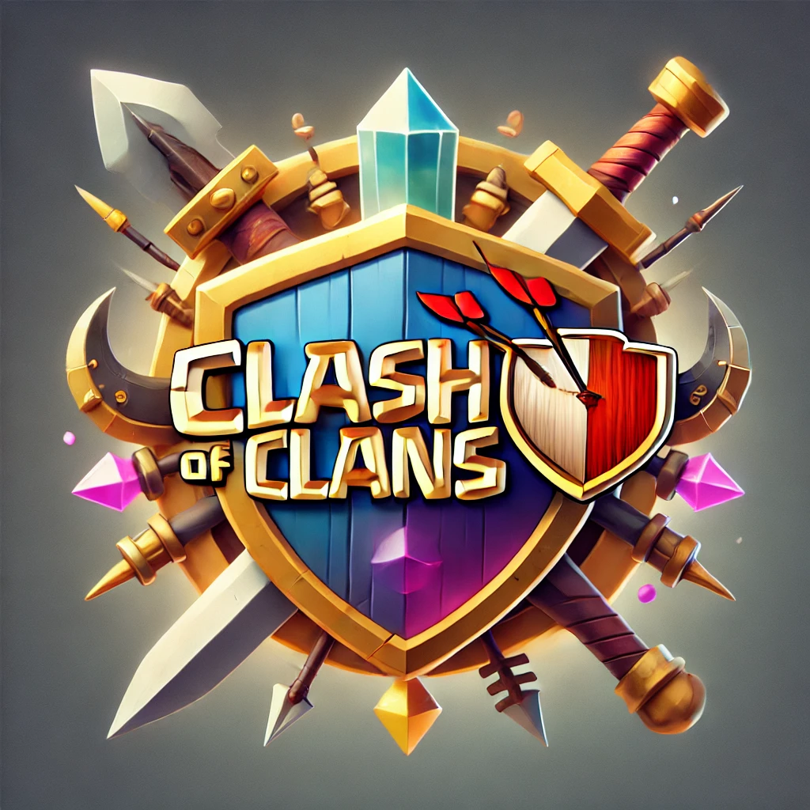

# Perekrutan Anggota Klan di Clash of Clans Menggunakan Algoritma Gale-Shapley

## Deskripsi Proyek

Proyek ini menerapkan **Algoritma Gale-Shapley**, juga dikenal sebagai **Stable Marriage Problem**, untuk membantu proses perekrutan anggota klan dalam game **Clash of Clans**. Algoritma ini berguna untuk mencocokkan pemain dengan klan berdasarkan spesifikasi dan preferensi mereka, sehingga dapat membentuk klan yang kuat dan saling mendukung dalam mencapai tujuan di game.

### Tujuan Proyek

- **Optimalisasi Perekrutan**: Mempercepat proses perekrutan anggota klan yang sesuai dengan tujuan klan.
- **Pencocokan Stabil**: Memastikan tidak ada pemain atau klan yang lebih memilih opsi lain dibandingkan dengan yang telah dipasangkan.
  
## Fitur Utama

- **Input Pemain dan Klan**: Pemain dapat memasukkan data seperti jumlah trophy, bintang perang, dan donasi. Klan juga memiliki data seperti level, total trophy, dan kemenangan perang.
- **Preferensi**: Pemain dan klan memberikan preferensi terhadap satu sama lain, seperti preferensi klan terhadap jumlah trophy dan preferensi pemain terhadap level klan.
- **Algoritma Pencocokan**: Algoritma Gale-Shapley akan memproses data dan menghasilkan pasangan pemain dan klan yang stabil.

## Cara Kerja Algoritma

Algoritma Gale-Shapley bekerja dengan cara mencocokkan pemain dengan klan sesuai dengan preferensi masing-masing. Setiap pemain akan melamar klan sesuai urutan preferensi, dan klan akan memilih pemain yang dianggap paling sesuai dengan preferensinya.

## Contoh Penggunaan

Misalnya, seorang pemain memiliki 3000 trophy dan preferensi terhadap klan dengan level tinggi. Klan yang memiliki banyak kemenangan perang akan lebih tertarik dengan pemain yang memiliki banyak bintang perang.

## Hasil dan Kesimpulan

Proyek ini menunjukkan bahwa algoritma Gale-Shapley dapat diterapkan secara efektif dalam proses perekrutan anggota klan di Clash of Clans, sehingga proses pencocokan pemain dengan klan menjadi lebih efisien dan sesuai dengan preferensi kedua belah pihak.

---

© 2024 Rahmat Hidayat.
